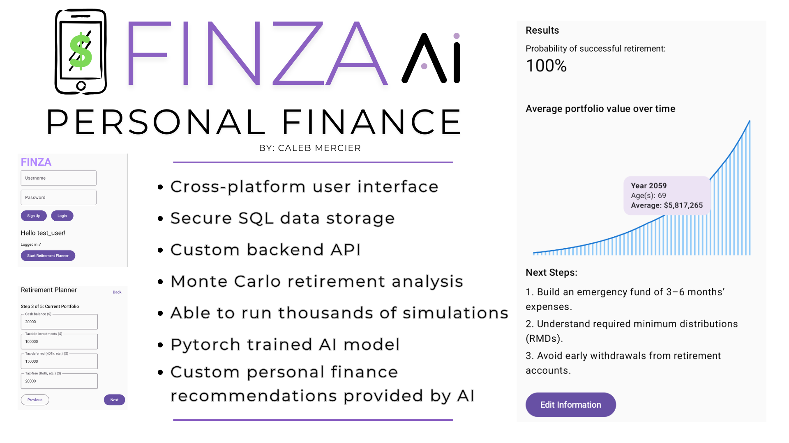

# 🤖 Finza: AI-Powered Robo Advisor

## Description
Finza is a full-stack financial planning application that generates personalized retirement recommendations using machine learning and simulation. The system combines a cross-platform frontend, a secure backend API, and a Monte Carlo simulation engine to model long-term financial outcomes under uncertainty.

The platform enables users to input financial data, simulate thousands of potential market scenarios, and receive AI-driven recommendations tailored to their financial goals.

This project demonstrates core software engineering concepts used in modern fintech platforms, including scalable backend architecture, data-driven modeling, and AI-assisted decision systems.

---

## Highlights

- **Full-Stack Architecture**
  - Kotlin Multiplatform frontend
  - FastAPI backend
  - PostgreSQL relational database
  - Clear separation between client, API, and data layers

- **AI-Driven Recommendations**
  - PyTorch-trained model for financial insights
  - Personalized retirement strategies based on user data
  - Integration of ML outputs into application workflows

- **Monte Carlo Simulation Engine**
  - Thousands of stochastic simulations per request
  - Models portfolio growth under market volatility
  - Generates probability-based retirement success metrics

- **Secure Backend Design**
  - RESTful API with structured request/response handling
  - Input validation and controlled data persistence
  - Scalable service-oriented backend architecture

- **User-Focused Experience**
  - Interactive financial input workflows
  - Real-time simulation feedback
  - Clear visualization of long-term financial outcomes



---

## Getting Started

### Requirements

#### Backend Requirements
- Python 3.9+
- FastAPI
- PostgreSQL

#### Frontend Requirements
- Kotlin Multiplatform environment

#### Machine Learning Requirements
- PyTorch

---

### Install Backend Dependencies

```bash
python3 -m venv .venv
source .venv/bin/activate
pip install fastapi uvicorn psycopg2-binary torch
```

### Running the Backend

```bash
uvicorn main:app --reload
```

The API will be available at:

```bash
http://127.0.0.1:8000
```

### Running the Frontend

Open the Kotlin Multiplatform project in your IDE and run the appropriate target (Android, iOS, or Desktop depending on configuration).

## Architecture

### System Architecture

```bash
Frontend (Kotlin Multiplatform)
        ↓
REST API (FastAPI)
        ↓
Simulation Engine + AI Model
        ↓
PostgreSQL Database
```

## Core Components

### Backend API
- Handles user input and financial data
- Coordinates simulation and AI inference
- Returns structured financial insights

### Simulation Engine
- Monte Carlo simulation of investment portfolios
- Models inflation, withdrawals, and market variability
- Produces statistical summaries and projections

### AI Model
- PyTorch-based model trained on financial data
- Generates personalized recommendations
- Integrated into backend decision pipeline

### Frontend
- Cross-platform user interface
- Input forms for financial planning
- Visualization of results and recommendations

## Technical Concepts Demonstrated

### Full-Stack Development
- Cross-platform frontend + REST backend
- API design and integration
- Database-backed applications
  
### Machine Learning Integration
- PyTorch model training and inference
- AI-driven recommendation systems
- Integration of ML into production workflows
  
### Simulation & Modeling
- Monte Carlo methods
- Probabilistic financial modeling
- Scenario-based analysis
  
### Backend Engineering
- FastAPI service design
- Input validation and structured responses
- Scalable architecture patterns

## Tips

- Use realistic financial inputs to observe meaningful simulation results.
- Experiment with different investment assumptions to see how outcomes change.
- Ensure your PostgreSQL database is running before starting the backend.
- Keep the backend running while interacting with the frontend.

## Project Purpose

Project Purpose

This project was designed as a portfolio demonstration of skills relevant to:

- Financial technology (FinTech)
- AI-assisted applications
- Backend and API engineering
- Data-driven decision systems
- Simulation and modeling systems
